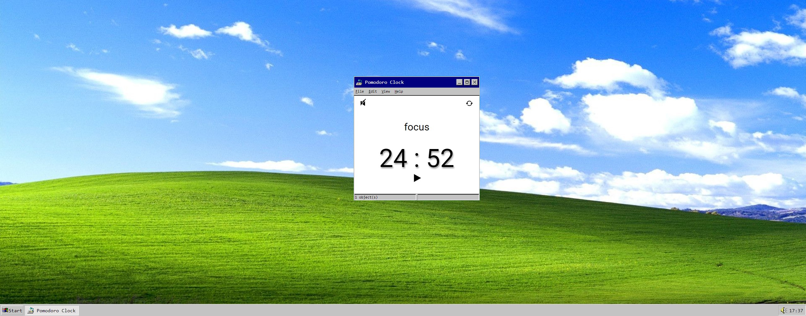
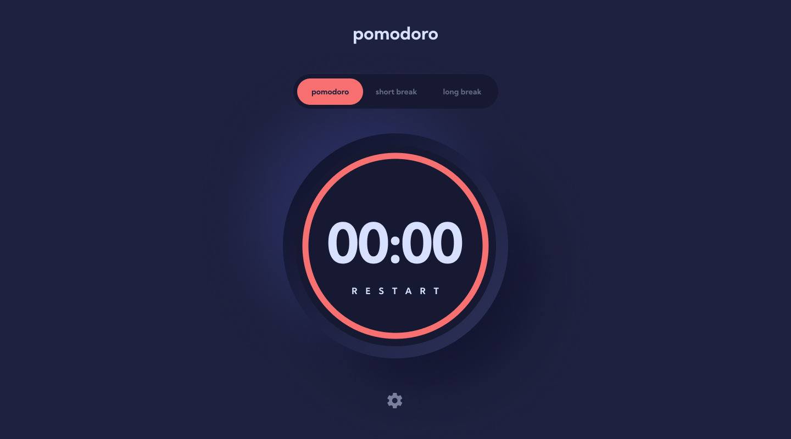

# Personal Portfolio

This is a pomodoro clock with HTML, CSS and Vanilla JavaScript

## Tabela de conteúdos

- [Overview](#overview)
  - [Goals](#goals)
  - [Screenshots](#screenshots)
  - [Links](#links)
- [The process](#the-process)
  - [Maded with](#maded-with)
  - [what i`m learning](#what-im-learning)
  - [timeline](#timeline)
- [Author](#author)
- [Final Considerations](#final-considerations)


## Overview

### Goals

Remake my old pomodoro clock to a better looking and more flexible usage.

- Deliver an amazing *User Experience*
- Create a beaty *User Interface*
- Create a good and readable code 
- Make it responsive in any device 

### screenshots


First pomodoro UI



Final version





### Links

- Website Link: [clique para acessar](https://markoscomk.github.io/pomodoro-clock/)

## The process

### Maded with

- HTML
- CSS
- SASS
- JavaScript

### What i`m learning

It`s really challenging make an round countdown need some "jerry-rig" with the css to make the countdown look's like a round countdown

this is the first version movable window code
```js
topBar.addEventListener('mousedown', dragStart)
topBar.addEventListener('mouseup', dragEnd)
// topBar.addEventListener('mouseout', dragOut)
topBar.addEventListener('mousemove', move)


function dragStart(e){
    mouseStartX = e.clientX
    mouseStartY = e.clientY
    isDragging = true
}

function dragEnd(e){
    mouseEndX = e.clientX
    mouseEndY = e.clientY
    appX += mouseEndX - mouseStartX
    appY += mouseEndY - mouseStartY
    isDragging = false
}

```


below the root colors
```css
  :root{
    --orange: #F87070;
    --blue: #70F3F8;
    --purple: #D881F8;
    --grey-purple: #D7E0FF;
    --dark-bg-1: #1E213F;
    --dark-bg-2: #161932;
    --white: #ffffff;
    --grey: #EFF1FA;
 }
```


### Timeline

First version of this pomodoro started in 05 of january 2022 and second version (actual) started in march/2023


## Author

- linkedin - [@MarkosComK](https://www.linkedin.com/in/markos-soares/)
- Github - [MarkosComK](https://github.com/MarkosComK)
- Frontend Mentor - [@MarkosComK](https://www.frontendmentor.io/profile/MarkosComK)
- instagram - [@MarkosComK](https://www.instagram.com/markoscomk/)

## Final considerations

If you want to give me some feedback, tip, or just talk to me, feel free to contact me through any of my social medias.

"Tudo acontece por uma razão e esta existe para me[/te] ajudar." 😎

<br>

<div>
  <a href="https://www.linkedin.com/in/markos-soares/">
    
  </a> 
  <a href="https://instagram.com/MarkosComK" target="_blank"></a>
  <a href="https://twitter.com/markoscomk" target="_blank"></a>
 <a href = "mailto:markoscomks@gmail.com"></a>
</div>

<br>