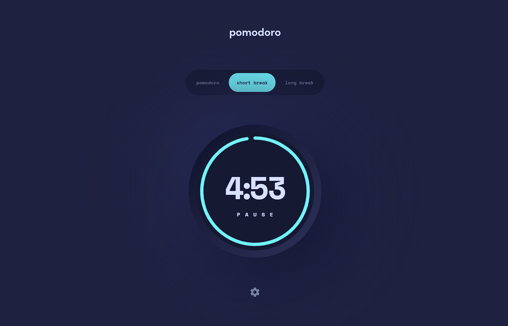

# Frontend Mentor - Pomodoro app solution

This is a solution to the [Pomodoro app challenge on Frontend Mentor](https://www.frontendmentor.io/challenges/pomodoro-app-KBFnycJ6G). Frontend Mentor challenges help you improve your coding skills by building realistic projects.

## Table of contents

- [Overview](#overview)
  - [The challenge](#the-challenge)
  - [Screenshot](#screenshot)
  - [Links](#links)
- [My process](#my-process)
  - [Built with](#built-with)
  - [What I learned](#what-i-learned)
  - [Useful resources](#useful-resources)
- [Author](#author)
- [Final Considerations](#final-considerations)


## Overview

A pomodoro app. 

### The challenge

Users should be able to:

- Set a pomodoro timer and short & long break timers
- Customize how long each timer runs for
- See a circular progress bar that updates every minute and represents how far through their timer they are
- Customize the appearance of the app with the ability to set preferences for colors and fonts

### Screenshot

First version


Final App


### Links

- Github Repo: [click here](https://github.com/MarkosComK/pomodoro-clock)
- Live Site: [click here](https://markoscomk.github.io/pomodoro-clock/)

## The process

### Built with

- HTML5
- CSS
- SCSS
- JavaScript

### What I learned

- labels as customized (hidden) radio buttons
- implementing SVGs as icont in the markup to minimize HTTP requests
- manipulating SVGs by JavaScript to animate the timer arc ([see resources](#useful-resources))

- First version movable window code
```js
topBar.addEventListener('mousedown', dragStart)
topBar.addEventListener('mouseup', dragEnd)
// topBar.addEventListener('mouseout', dragOut)
topBar.addEventListener('mousemove', move)


function dragStart(e){
    mouseStartX = e.clientX
    mouseStartY = e.clientY
    isDragging = true
}

function dragEnd(e){
    mouseEndX = e.clientX
    mouseEndY = e.clientY
    appX += mouseEndX - mouseStartX
    appY += mouseEndY - mouseStartY
    isDragging = false
}
```

### Useful resources

- [SVGs](http://xahlee.info/js/svg_circle_arc.html) -  This page helped me to see how SVGs are built up and can be used.
- [How SVG arcs can be calculated and alterated](https://stackoverflow.com/questions/5736398/how-to-calculate-the-svg-path-for-an-arc-of-a-circle) - A great thread on stackoverflow on displaying and manipulating SVG circles via JavaScript.

### Timeline

First version of this pomodoro started in 05 of january 2022 and second version (actual) started in march/2023


## Author

- linkedin - [@MarkosComK](https://www.linkedin.com/in/markos-soares/)
- Github - [MarkosComK](https://github.com/MarkosComK)
- Frontend Mentor - [@MarkosComK](https://www.frontendmentor.io/profile/MarkosComK)
- instagram - [@MarkosComK](https://www.instagram.com/markoscomk/)

## Final considerations

If you want to give me some feedback, tip, or just talk to me, feel free to contact me through any of my social medias.

"Tudo acontece por uma razão e esta existe para me[/te] ajudar." 😎

<br>

<div>
  <a href="https://www.linkedin.com/in/markos-soares/">
    
  </a> 
  <a href="https://instagram.com/MarkosComK" target="_blank"></a>
  <a href="https://twitter.com/markoscomk" target="_blank"></a>
 <a href = "mailto:markoscomks@gmail.com"></a>
</div>

<br>